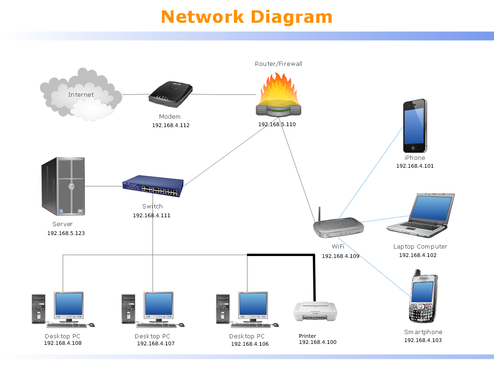

### HTML webpage showing definitions of network elements:


###### Main HTML webpage code (network.html):
```.html

<!DOCTYPE html>
<html lang="en">
<head>
    <meta charset="UTF-8">
    <title>Network Elements</title>
</head>

<body>

<h3>Click on the following links to read the definitions of each network elements
    of the diagram below:</h3>
<ul>
    <li><a href="desktop&laptop.html">Desktop PC & Laptop computer</a></li>
    <li><a href="printer.html">Printer</a></li>
    <li><a href="smartphone.html">Smartphone</a></li>
    <li><a href="switch.html">Switch</a></li>
    <li><a href="server.html">Server</a></li>
    <li><a href="firewall&router.html">Router/Firewall</a></li>
    <li><a href="modem.html">Modem</a></li>
    <li><a href="Internet.html">Internet</a></li>
</ul>



</body>
</html>

```
-network_diagram.png:


-desktop&laptop.html:
```.html

<!DOCTYPE html>
<html lang="en">
<head>
    <meta charset="UTF-8">
    <title>DesktopPC & Laptop</title>
</head>

<body>
<h1>DesktopPC & Laptop</h1>
<h3>Desktop:</h3>
<h5>A desktop computer is a personal computer
    designed for regular use at a single location
    on or near a desk or table due to its size and power requirements. </h5>
<br>
<h3>Laptop:</h3>
<h5>A laptop or laptop computer is a small, portable personal computer (PC)
    with a "clamshell" form factor, typically having a thin LCD or LED computer
    screen mounted on the inside of the upper lid of the clamshell and an alphanumeric
    keyboard on the inside of the lower lid. The clamshell is opened up to use the computer.
    Laptops are folded shut for transportation, and thus are suitable for mobile use.</h5>
<br>

<a href="network.html">Go back home</a>

</body>
</html>

```

-printer.html:
```.html

<!DOCTYPE html>
<html lang="en">
<head>
    <meta charset="UTF-8">
    <title>Printer</title>
</head>
<body>
<h1>Printer</h1>

<h5>A printer is a peripheral machine which makes a
    persistent representation of graphics or text,
    usually on paper. While most output is human-readable,
    bar code printers are an example of an expanded use for printers.
    The different types of printers include 3D printer, inkjet printer,
    laser printer, thermal printer, etc.</h5>

<br>

<a href="network.html">Go back home</a>
</body>
</html>

```

-smartphone.html:
```.html

<!DOCTYPE html>
<html lang="en">
<head>
    <meta charset="UTF-8">
    <title>Smartphone</title>
</head>
<body>

<h1>Smartphone</h1>

<h5>A smartphone is a mobile device that combines
    cellular and mobile computing functions into one
    unit. They are distinguished from feature phones
    by their stronger hardware capabilities and extensive
    mobile operating systems, which facilitate wider software,
    internet (including web browsing[1] over mobile broadband),
    and multimedia functionality (including music, video, cameras,
    and gaming), alongside core phone functions such as voice calls
    and text messaging.</h5>

<br>

<a href="network.html">Go back home</a>

</body>
</html>

```

-switch.html:
```.html

<!DOCTYPE html>
<html lang="en">
<head>
    <meta charset="UTF-8">
    <title>Switch</title>
</head>
<body>
<h1>Switch</h1>

<h5>A network switch is networking hardware that connects
    devices on a computer network by using packet switching
    to receive and forward data to the destination device.

</h5>

<br>

<a href="network.html">Go back home</a>
</body>
</html>

```

-server.html:
```.html

<!DOCTYPE html>
<html lang="en">
<head>
    <meta charset="UTF-8">
    <title>Server</title>
</head>
<body>
<h1>Server</h1>

<h5>A server is a piece of computer hardware or
    software (computer program) that provides
    functionality for other programs or devices,
    called "clients". This architecture is called
    the client–server model. Servers can provide
    various functionalities, often called "services",
    such as sharing data or resources among multiple clients,
    or performing computation for a client. A single server
    can serve multiple clients, and a single client can use
    multiple servers.</h5>

<br>

<a href="network.html">Go back home</a>
</body>
</html>

```

-firewall&router.html:
```.html

<!DOCTYPE html>
<html lang="en">
<head>
    <meta charset="UTF-8">
    <title>Firewall (a router)</title>
</head>
<body>
<h1>Firewall</h1>

<h5>A firewall is a network security system that monitors
    and controls incoming and outgoing network traffic based
    on predetermined security rules. A firewall typically
    establishes a barrier between a trusted network and an untrusted
    network, such as the Internet.</h5>

<br>

<a href="network.html">Go back home</a>
</body>
</html>

```
-modem.html:
```.html
<!DOCTYPE html>
<html lang="en">
<head>
    <meta charset="UTF-8">
    <title>Modem</title>
</head>
<body>
<h1>Modem</h1>

<h5>Modem is a hardware device that converts data from a digital format,
    intended for communication directly between devices with specialized wiring,
    into one suitable for a transmission medium such as telephone lines or radio.
    A modem modulates one or more carrier wave signals to encode digital information
    for transmission, and demodulates signals to decode the transmitted information.
    The goal is to produce a signal that can be transmitted easily and decoded reliably
    to reproduce the original digital data.</h5>

<br>

<a href="network.html">Go back home</a>
</body>
</html>

```

-Internet.html:
```.html

<!DOCTYPE html>
<html lang="en">
<head>
    <meta charset="UTF-8">
    <title>Internet</title>
</head>
<body>
<h1>Internet</h1>

<h5>Internet is the global system of interconnected computer networks
    that uses the Internet protocol suite (TCP/IP) to communicate between
    networks and devices. It is a network of networks that consists of private,
    public, academic, business, and government networks of local to global scope,
    linked by a broad array of electronic, wireless, and optical networking technologies.
    The Internet carries a vast range of information resources and services, such as the
    inter-linked hypertext documents and applications of the World Wide Web (WWW), electronic mail,
    telephony, and file sharing.</h5>

<br>

<a href="network.html">Go back home</a>
</body>
</html>

```

