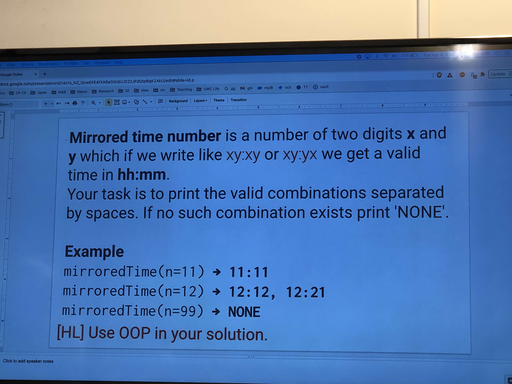
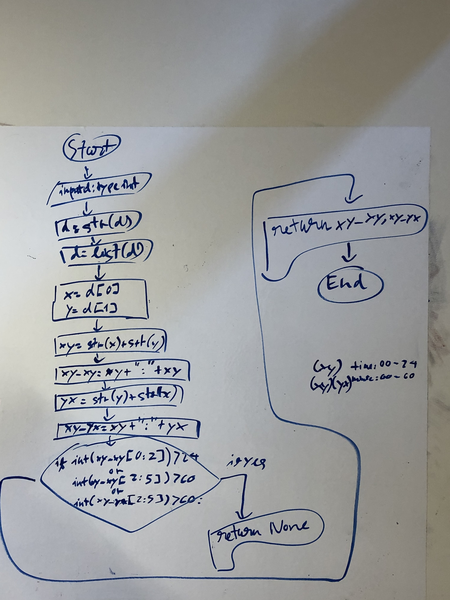
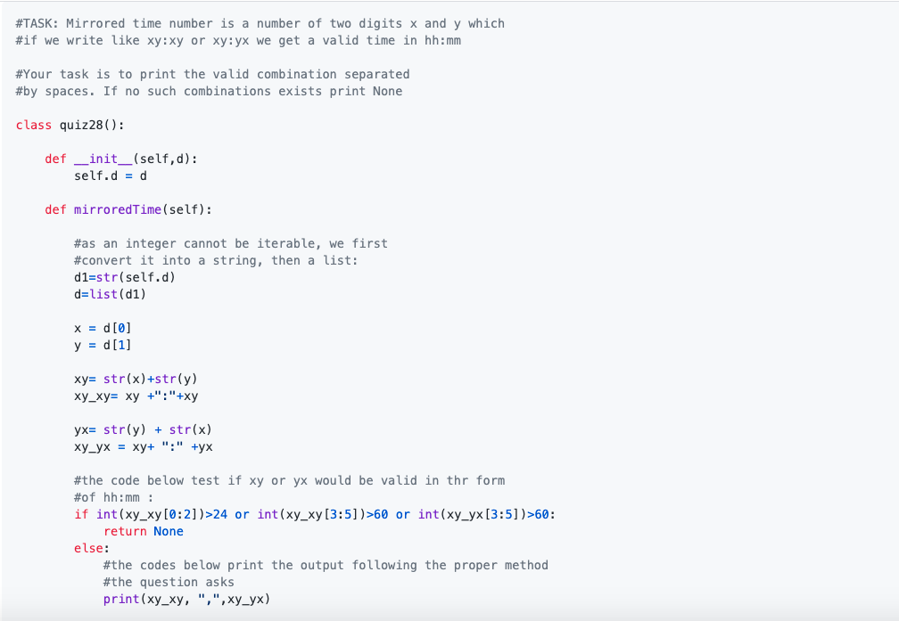
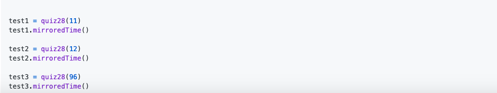

##### Problem
Create an HTML+CSS page that shows the solution for the quiz and the flow diagram as an image. Called quiz28.html. Make it pretty

##### Solution

###### Image


###### Code

-HTML:

```.html

<!DOCTYPE html>
<html lang="en">
<head>
    <link href="https://cdn.jsdelivr.net/npm/bootstrap@5.0.0-beta3/dist/css/bootstrap.min.css" rel="stylesheet" integrity="sha384-eOJMYsd53ii+scO/bJGFsiCZc+5NDVN2yr8+0RDqr0Ql0h+rP48ckxlpbzKgwra6" crossorigin="anonymous">
    <meta charset="UTF-8">
    <link rel="stylesheet" href="quiz28.css">
    <script src="quiz28.js"></script>
    <title>Quiz 28</title>
</head>


<body>

<h1 class="text-center">Quiz 28</h1>
<h5 class="text-center">Click on an image OR on the right/left arrow to view the image close up with its description.</h5>
<h6 class="text-center">Created by Kien Le Trung</h6>

<!-- Container for the image gallery -->
<div class="container">

    <!-- Full-width images with number text -->

    <div class="mySlides">
        <div class="numbertext">1 / 6</div>
        
    </div>

    <div class="mySlides">
        <div class="numbertext">2 / 6</div>
        
    </div>

    <div class="mySlides">
        <div class="numbertext">3 / 6</div>
        
    </div>

    <div class="mySlides">
        <div class="numbertext">4 / 6</div>
        
    </div>

    <!-- Next and previous buttons -->
    <a class="prev" onclick="plusSlides(-1)">&#10094;</a>
    <a class="next" onclick="plusSlides(1)">&#10095;</a>

    <!-- Image text -->
    <div class="caption-container">
        <p id="caption"></p>
    </div>

    <!-- Thumbnail images -->
    <div class="row">

        <div class="column">
            
        </div>

        <div class="column">
            
        </div>
        <div class="column">
            
        </div>
        <div class="column">
            
        </div>
        </div>
    </div>
</div>

</body>

</html>


```


-CSS:

```.css

* {
    box-sizing: border-box;
}

.image{
    alignment: center;
}

/* Position the image container (needed to position the left and right arrows) */
.container {
    position: relative;
    alignment: center;
    width: 100%;
    max-width: 1800px;
    height:100%;
    max-height:850px;
}

/* Hide the images by default */
.mySlides {
    display: none;
}

/* Add a pointer when hovering over the thumbnail images */
.cursor {
    cursor: pointer;
}

/* Next & previous buttons */
.prev,
.next {
    cursor: pointer;
    position: absolute;
    top: 40%;
    width: auto;
    padding: 16px;
    margin-top: -50px;
    color: black;
    font-weight: bold;
    font-size: 20px;
    border-radius: 0 3px 3px 0;
    user-select: none;
    -webkit-user-select: none;
}

/* Position the "next button" to the right */
.next {
    right: 0;
    border-radius: 3px 0 0 3px;
}

/* On hover, add a black background color with a little bit see-through */
.prev:hover,
.next:hover {
    background-color: rgba(0, 0, 0, 0.8);
}

/* Number text (1/3 etc) */
.numbertext {
    color: #f2f2f2;
    font-size: 12px;
    padding: 8px 12px;
    position: absolute;
    top: 0;
}

/* Container for image text */
.caption-container {
    text-align: center;
    background-color: #222;
    padding: 2px 16px;
    color: white;
}

.row:after {
    content: "";
    display: table;
    clear: both;
}

/* Six columns side by side */
.column {
    float: left;
    width: 16.66%;
}

/* Add a transparency effect for thumnbail images */
.demo {
    opacity: 0.6;
}

.active,
.demo:hover {
    opacity: 1;
}

```

-Javascript:

```.js

var slideIndex = 1;
showSlides(slideIndex);

// Next/previous controls
function plusSlides(n) {
    showSlides(slideIndex += n);
}

// Thumbnail image controls
function currentSlide(n) {
    showSlides(slideIndex = n);
}

function showSlides(n) {
    var i;
    var slides = document.getElementsByClassName("mySlides");
    var dots = document.getElementsByClassName("demo");
    var captionText = document.getElementById("caption");
    if (n > slides.length) {slideIndex = 1}
    if (n < 1) {slideIndex = slides.length}
    for (i = 0; i < slides.length; i++) {
        slides[i].style.display = "none";
    }
    for (i = 0; i < dots.length; i++) {
        dots[i].className = dots[i].className.replace(" active", "");
    }
    slides[slideIndex-1].style.display = "block";
    dots[slideIndex-1].className += " active";
    captionText.innerHTML = dots[slideIndex-1].alt;
}

```

-IMG_02972.jpg:


-IMG_0296.JPG:


-code1.png:


-code2.png:


